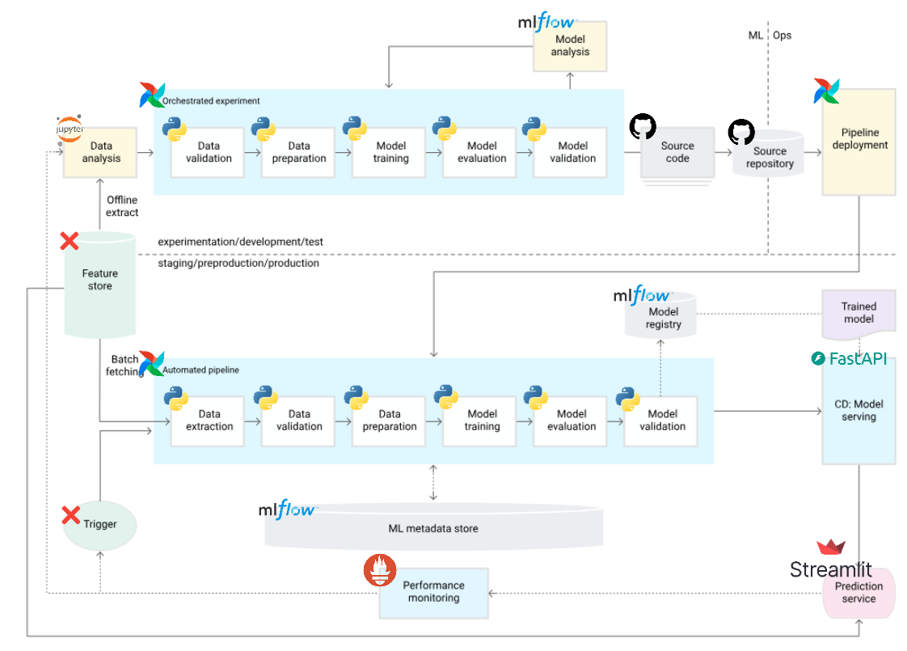

# Employee Future Prediction

This project aims to predict the future status of employees using machine learning techniques. The goal is to leverage MLOps maturity level 1 practices as defined by Google to ensure a robust and scalable solution.

## Project Overview

- **Objective**: Predict employee attrition and other future states.
- **Tech Stack**: Python, Docker, Airflow, FastAPI, Streamlit and Prometheus.

## Schematic of the solution

---

🧠 Made in Chesar's bedroom